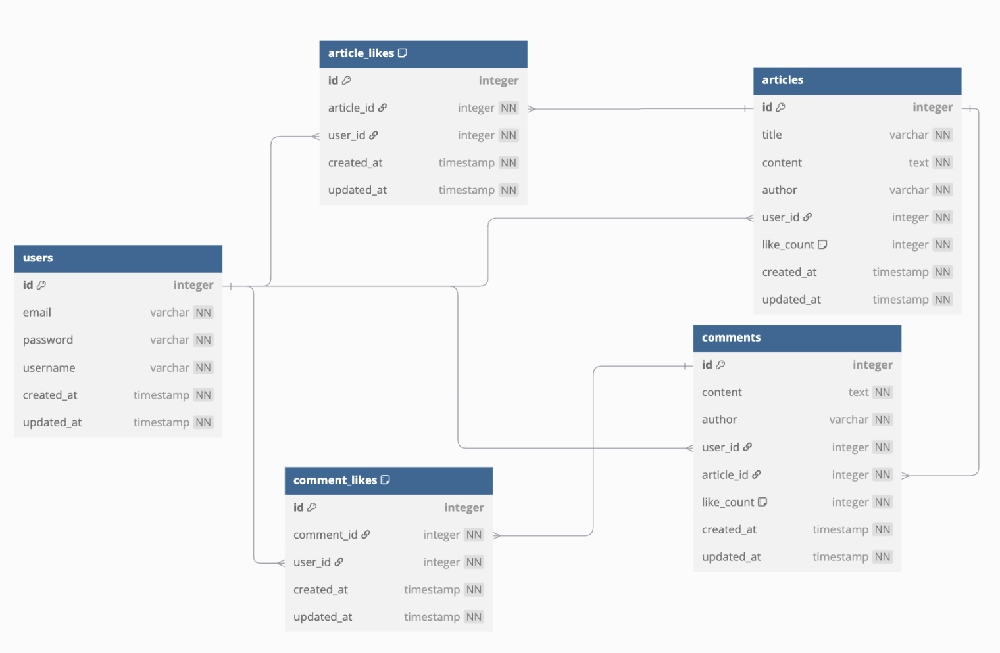
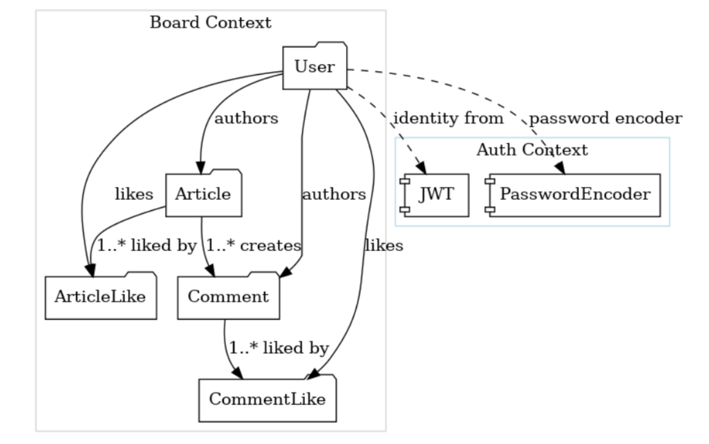

# MyBoard

## 🛠 개요
이 저장소는 **Spring Boot**, **JPA**, **Spring Security** 등을 활용해  
간단한 게시판 도메인 모델로 구성된 백엔드 기술 스택 연습용 예제 애플리케이션입니다.

---

## 🗺️ ER Diagram

  

### 테이블별 설명

| 테이블명           | 설명                                                                 |
|--------------------|----------------------------------------------------------------------|
| **users**          | 사용자 계정 정보를 담는 테이블 (PK: `id`, 유니크: `email`)            |
| **articles**       | 게시글(`title`, `content`), 작성자(`user_id`), 좋아요 수(`like_count`)를 저장 |
| **comments**       | 댓글(`content`), 작성자(`user_id`), 대상 게시글(`article_id`), 좋아요 수(`like_count`)를 저장 |
| **article_likes**  | 게시글 좋아요 조인 테이블 `(article_id, user_id)` 유니크 제약으로 중복 방지 |
| **comment_likes**  | 댓글 좋아요 조인 테이블 `(comment_id, user_id)` 유니크 제약으로 중복 방지 |

---

## 📦 Bounded Context & Aggregates

  

### 컨텍스트 및 애그리게이트 개요

- **Board Context** (회색 영역)
    - `User`, `Article`, `Comment`, `ArticleLike`, `CommentLike` 애그리게이트가  
      동일한 “게시판” 비즈니스 언어를 공유합니다.
    - **실선 화살표**: 애그리게이트 간 연관 관계(작성자, 댓글, 좋아요 등)를 나타냅니다.

- **Auth Context** (파란 영역)
    - `JWT`, `PasswordEncoder` 등 인증·인가 인프라 전용 경계입니다.
    - **점선 화살표**: `User.id`를 이용해 Auth Context 기능(JWT 발급·암호화)을 호출하는 경계를 표시합니다.

---
